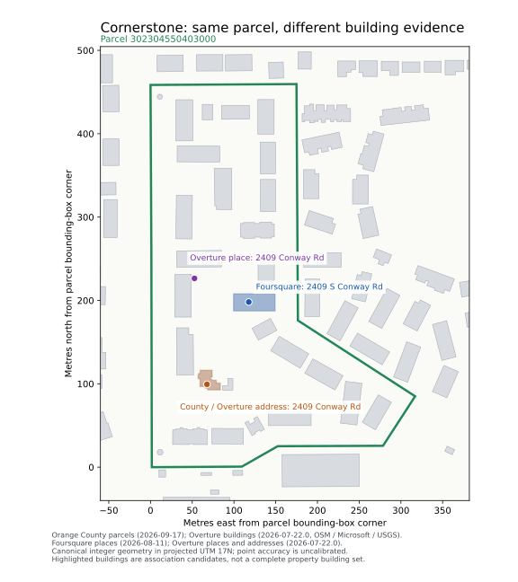

# Cornerstone with national place evidence

**National evidence changes Cornerstone from 2,983 tied parcel candidates to
one preferred parcel: `302304550403000`.** Foursquare finds it; Overture
corroborates it. At building grain, two buildings tie for the best soft rank.
The native solver still abstains from forced identity.

| Supplied evidence | Candidate universe | Best soft result | Best / other cost | Hard residual |
|---|---:|---|---|---:|
| Prior descriptive name and operator address | 2,983 parcels | All tied | 0 / 0 | 2,983 |
| Foursquare place | Same 2,983 parcels | `302304550403000` | 0 / 1 | 2,983 |
| Foursquare + Overture place/address | Same 2,983 parcels | Same parcel | 0 / 2 | 2,983 |
| National evidence at building grain | 347 nearby buildings | Two buildings tied | 1 / 2 | 347 |

Costs count absent preferences; they are not probabilities. The source families
share geometry and operator evidence, so their count is not statistical independence.
The prior result is retained in the
[Orlando experiment](../addressless_orlando_2026-09-17/README.md).



## What supplies the missing connection

- Foursquare release `2026-08-11`, place `4c61282fb6f3be9aa7f36073`, records
  **Cornerstone, 2409 S Conway Rd, Orlando, FL 32812**. Its name agrees with the
  supplied property name; a declared `South` / `S` abbreviation preserves the
  directional meaning. Its point falls inside the preferred parcel.
- Overture Places release `2026-07-22.0`, feature
  `7bef8d4a-8fe2-4ae5-adae-02db204536bb`, records **The Cornerstone Apartments,
  2409 Conway Rd**, and the exact supplied
  [operator URL](https://livebh.com/apartments/the-cornerstone/).
  Its point falls inside the same parcel. The primary upstream source is Meta.
  The missing directional is preserved; no `South`-stripping rule is introduced.
- The county address point explicitly links **2409 CONWAY RD** to parcel
  `302304550403000`. Overture Addresses feature
  `39310ded-e737-4c47-ae28-0cfe3c15fb8b` repeats county-derived address evidence
  through OpenAddresses. It extends provenance on the existing observation and
  earns no additional preference. Address feature IDs are not treated as stable
  GERS property identities.
- Foursquare's point falls inside Overture building
  `a6145c70-10cb-46d0-95b8-b85ff82ac700`. The county address point falls inside
  `0a5045cd-8321-429b-b0b7-0f3f24b6e615`. Overture's place point falls outside
  every retained building footprint. These are different locations within the
  same parcel; choosing one point as the entire property's building identity
  would overstate the evidence.

The native parcel runs contain every original candidate, including unknowns.
The property was already known from the earlier experiment: this is a
corroboration diagnostic, not a fresh blind subject or portfolio accuracy result.
Current source snapshots do not establish the REIT's December 2025 physical extent.

## Profile and implementation boundary

`national_place_support.v0` is an **experimental offline adapter policy**, retained
with executable code. It supplies ordinary warehouse rows to the existing Geo DAG.
It is not a shipped `--profile national` command or an extension of NYC/PAD's native
address-membership contract. Acquisition remains external to Canon.

Within matching state plus city or ZIP, an exact lowercase/whitespace name,
declared street-key agreement, or exact supplied property URL can support a place.
The street key only abbreviates a first directional token and final street suffix;
it preserves absent/opposite directionals, different streets, units, and ranges.
No entity ID appears in the adapter's matching rules. Closed Foursquare places are
excluded. Categories and provider confidence fields do not force inclusion/exclusion.

The adapter derives support from retained geometry and explicit source links.
Coordinates are externally projected with pinned pyproj/PROJ into UTM 17N, then
Canon's existing integer geometry materializer and point-in-ring kernels evaluate
containment, holes, boundaries, and multiple polygon parts. The zero error bound
on the supplied planar metre-to-millimetre conversion does not assert zero error
for upstream coordinates or projection. Source point accuracy remains unknown.

Each place family with a single supported member contributes one uncalibrated
`prefer_member` observation of weight 1. Multiple competing members within a
family stay diagnostic. Duplicate county-derived address mirrors do not add
weight. The only hard constraint is the caller's one-associated-member question
premise. It does not assert that the property contains exactly one parcel or roof.
The current composition engine's claim label remains `collateral_composition`;
this experiment does not satisfy a complete collateral claim.

The first assembly used soft `existential_membership`; native admission correctly
returned `rho_soft_fallback_not_representable`, leaving all models tied. Those
three diagnostic runs and the original adapter are retained. The corrected adapter
uses the existing preference observation; no admission gate or runtime code changed.

## Retention and verification

`sources.tar.gz` contains all supplied rows, external query receipts, prior
acquisition links, the profile, the Python adapter, and the small Rust geometry
harness. `run.tar.gz` contains both initial diagnostic and final `*-supported`
runs, geometry artifacts, fresh inspections, native receipts, and verification logs.
`measurement.json` records hashes and actual outcomes.
Place records are retained query projections, with hashes of those supplied
projections; they do not pretend to authenticate unretained provider payloads.

The building query uses pinned release `2026-07-22.0`, H3 r4 `8444a91ffffffff`,
and bbox intersection with `[-81.335, 28.512, -81.326, 28.520]`. An independent
count reports 347 rows / 347 distinct IDs. All 347 full geometries were recovered
as 705 ordered chunks. The acquisition receipt records a 200-row tool cap and an
unordered `RESULT_SCAN` pagination defect; those incomplete pages were rejected.
Every reconstructed feature has complete contiguous chunks. The bbox inventory
is a bounded candidate set, not proof that all property buildings are present.

The final three native runs complete nine stages and report `ABSTAINED`.
Fresh `geo inspect` succeeds; resume preserves all nine stage artifacts.
Separation and next-evidence inputs declare exhaustive hypothetical membership
partitions. They exercise residual planning without asserting that a future
source has supplied those outcomes or that an acquisition is currently available.
All 33 planned input artifacts and five shared geometry/support artifacts reproduce
byte-for-byte. Duplicating the Overture county-address mirror leaves all three
evidence-row bundles byte-identical. Six positive/negative geometry cases and
directional, street, unit, locality, and unrelated-name checks pass.

Canon runtime source is unchanged from `db72dfac5d6689bb8789f81ad93c5dad9339601e`.
The measurement binary uses release opt-level 2, no LTO, and 16 codegen units.
Elapsed times include concurrent runs/tests and are not a scale benchmark.
Quality-gate results are recorded in `measurement.json` and the archived logs.
Source calibration and accepted source-neutral address membership remain open
under `bd-ie4t`, `bd-3mft`, and `bd-33hh`.

## Offline replay

From the repository root, build Canon and the small measurement harness. The Cargo
JSON file supplies the exact linked library paths; no network acquisition is part
of the adapter or native run. Dependency installation/build may need network access.

```bash
experiment_dir=$(mktemp -d)
tar -xzf scripts/geo_measurements/fixtures/cornerstone_national_2026-09-17/sources.tar.gz -C "$experiment_dir"
CARGO_PROFILE_RELEASE_OPT_LEVEL=2 CARGO_PROFILE_RELEASE_LTO=false CARGO_PROFILE_RELEASE_CODEGEN_UNITS=16 cargo build --release --lib --bin canon --message-format=json > "$experiment_dir/build.jsonl"
python3 "$experiment_dir/build_predicate.py" --messages "$experiment_dir/build.jsonl" --output "$experiment_dir/predicate"
uv run --script "$experiment_dir/prepare.py" --root "$experiment_dir" --canon "$PWD/target/release/canon" --predicate "$experiment_dir/predicate" --variant-suffix=-supported
python3 "$experiment_dir/run_native.py" --work-dir "$experiment_dir/national-parcel-supported" --canon "$PWD/target/release/canon"
python3 "$experiment_dir/run_native.py" --work-dir "$experiment_dir/national-building-supported" --canon "$PWD/target/release/canon"
```

Run `foursquare-parcel-supported` similarly for the single-source ablation.
`check_adapter.py` exercises deterministic preparation and the negative cases;
`plot.py` redraws the retained evidence map after preparation.
